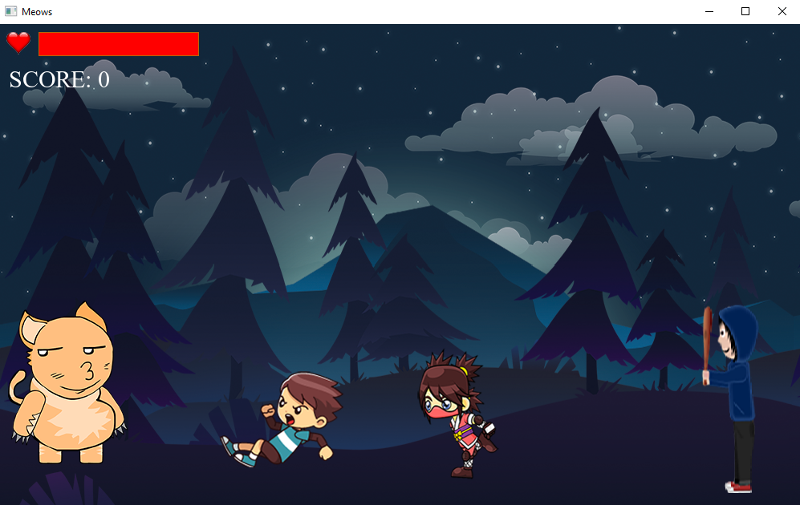
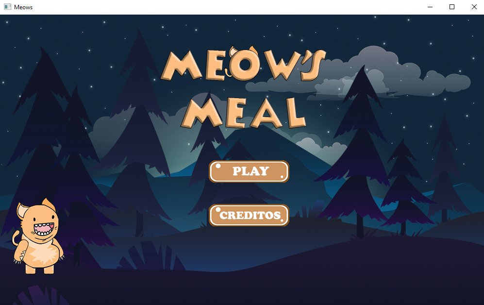
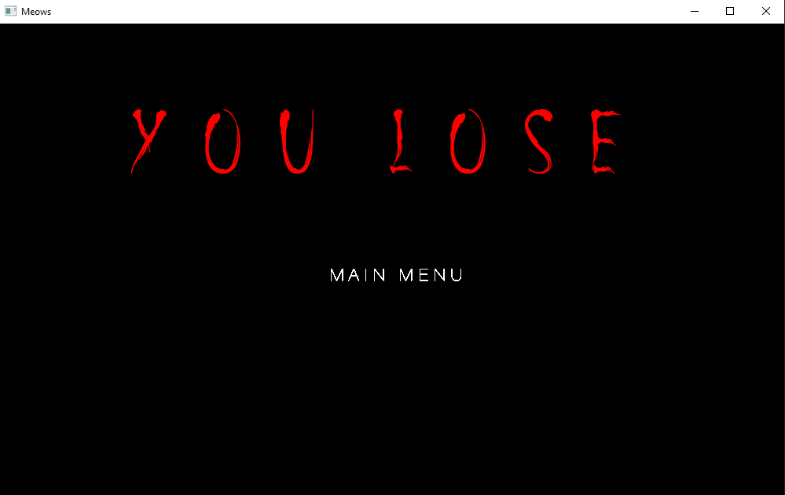

# Meow's
> Cleiton A. Ambrosini - 1411100039

Implementation a game with interaction with object lists, colision, keyboard and mouse input, with unless 3 states and with interaction with object lists.

Github Pages -> https://cleitonambrosini.github.io/GAMES-2019-T1/

## Controls

Keyboard.W -> UP

Keyborad.D -> Run

Mouse.LeftClick -> Shoot

## Screenshots

